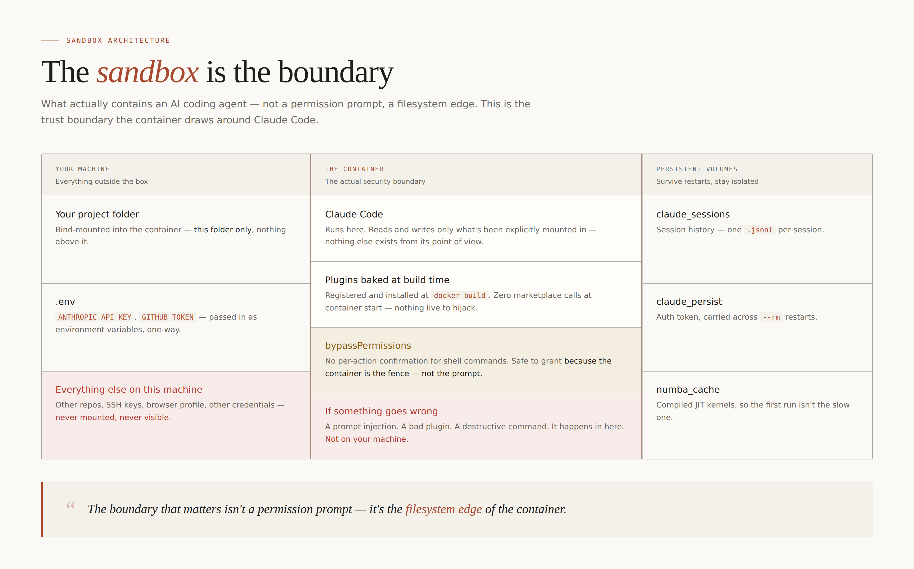

# The Sandbox Is the Feature: Why We Run Claude Code in a Box


*Fibtec's containerized Claude Code setup, open-sourced.*

---

Every few weeks there's a new story about an AI agent that had more access than anyone meant to give it, and used it. A coding agent that deleted the wrong directory. A plugin that phoned home with credentials it should never have seen. An assistant tricked by text in a file into running a command nobody typed.

None of that is a reason to stop using agentic coding tools. It's a reason to stop pretending a permission prompt is a security boundary.

We containerized Claude Code so the boundary is real instead of implied. Today we're open-sourcing that setup — **[claude-docker-public](https://github.com/fibtecltd/claude-docker-public)** — the same container we run Claude Code in across our own projects.

## A prompt is not a fence

Here's the uncomfortable part of running an AI agent with shell access: it *will* eventually be asked, tricked, or simply instructed to do something you didn't want. Maybe that's a hallucinated `rm -rf`. Maybe it's an instruction buried in a file the agent reads, engineered to look like something you'd have typed yourself. Maybe it's a plugin that's fine on Tuesday and compromised by Thursday.

You cannot prompt your way out of that risk. "Please don't do anything destructive" is not a control. It's a suggestion, and suggestions fail.

So we stopped relying on one. We put the agent in a box, and we made the box — not the prompt, not a permission dialog — the actual boundary.


*The container is the security boundary. Everything the agent can touch is drawn on purpose — not because it asked nicely.*

## What "the box" actually means

**The filesystem is the fence.** Claude Code runs inside a Docker container that can see exactly one thing from your machine: whichever project directory you've bind-mounted in. Not your home folder. Not your SSH keys. Not your browser profile, your other repos, or anything else sitting on disk. If it isn't mounted, it doesn't exist as far as the agent is concerned — and the compose file is built to mount as many project folders as you want, side by side, each one scoped to exactly itself.

**Credentials go in, nothing comes back out through the same door.** Your Anthropic API key and GitHub token arrive as environment variables — a one-way pass-through, not a shared secrets store the container can rummage through.

**Plugins are baked into the image, not fetched live.** Every plugin marketplace we use is registered and installed at `docker build` time. A container start makes zero network calls to any marketplace. There's no window where a plugin update — malicious or just broken — gets pulled in without us reviewing it first, because there's no live pull at all.

**Because the box is the boundary, we can afford to turn permission prompts off.** Our internal config runs Claude Code with `bypassPermissions` — no per-action confirmation for Bash, Write, Edit. That sounds alarming in isolation. It isn't, once you understand *why* it's safe: the worst thing an unattended agent can do is scoped to a container we throw away with `docker compose run --rm`. We say this loudly in the README, not as fine print — because "an AI agent that doesn't ask before running shell commands" is a real trade-off, and nobody should inherit it silently.

**Blast radius, not good intentions, is the design principle.** If a plugin turns out to be compromised, if a prompt injection succeeds, if the agent does something genuinely wrong — it happens inside a disposable container with no path back to your host. That's not a hope. It's a filesystem fact.

## One sandbox, any project

This isn't scoped to a single codebase. The image is built once; which project it works on is just which folder you bind-mount in — swap the path, or mount several at once, and the same container, the same plugin set, the same permission posture carries over untouched. We use it across our own repos day to day, [pyvar](https://github.com/fibtecltd/pyvar) — our open-source financial risk platform — among them. It's not a demo assembled to make a point; it's genuinely what several of our development loops run through right now.

## Try it

```bash
git clone https://github.com/fibtecltd/claude-docker-public
cd claude-docker-public
cp .env.example .env   # add your ANTHROPIC_API_KEY
docker compose build --no-cache claude
docker compose run --rm claude
```

Read `SETUP.md` first. The permission-mode section isn't optional reading — it's the one part of this setup where "I skimmed it" is how people get surprised.

## License

Apache-2.0. It bundles a few plugin marketplaces as forks under our GitHub org; each keeps its own upstream license, credited in `NOTICE`.

We built this to solve our own problem: an agent we trust with real shell access, in a place where "trust" doesn't have to mean "hope." If agentic coding tools are going to be a permanent part of how software gets built — and they are — the teams that treat the sandbox as the feature, not an afterthought, are the ones who'll still be shipping calmly a year from now.

Try it, break it, open an issue. We'd like to hear about it either way.

---

*Fibtec Limited builds regulatory-grade financial risk infrastructure. Find us at [fibtec.co.uk](https://fibtec.co.uk) and [pyvar.com](https://www.pyvar.com).*
